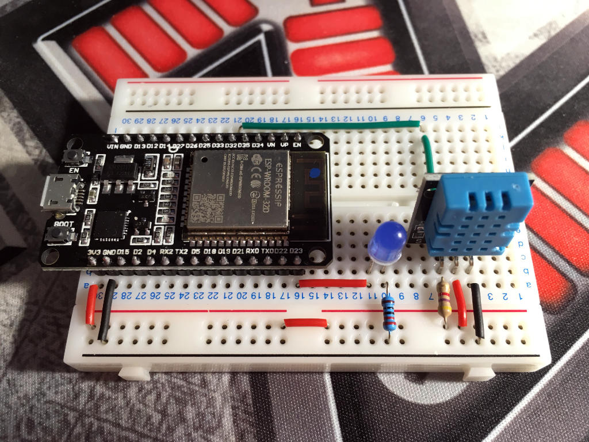
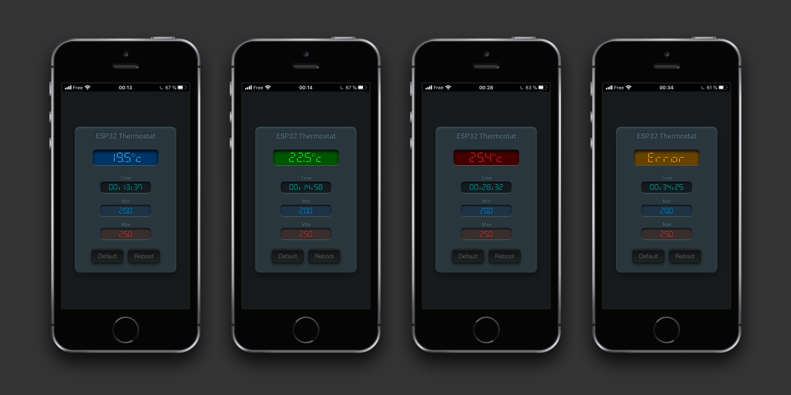
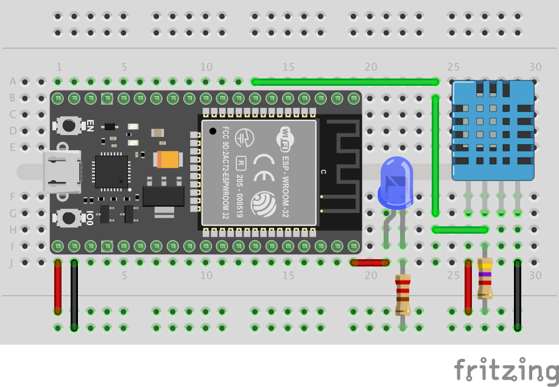

# ESP32 Asynchronous Web Controlled Thermostat

This project came out of [a discussion I had with Yves Bourdon][discussion], on the Random Nerd Tutorial Lab forum, on how to implement an updated web interface to control an ESP32, without needing to reload the whole page or submit a form. In other words, the idea here is to perform asynchronous requests from the client browser to query the microcontroller on the status of the data to be displayed, and then to perform local updates of the user interface as soon as the data provided by the ESP32 is received.

There are several techniques to achieve this, including the use of WebSockets, which I much prefer to traditional methods that rely on AJAX. Nevertheless, Yves wanted to understand how to implement this technique with AJAX. This is the purpose of this project. Another one will follow to illustrate how to proceed with WebSockets...


## Project Overview

To answer Yves' initial request for a connected thermostat, I chose to set up a fairly simple circuit with an ESP32 and a DHT11 temperature sensor (but any sensor can do the job). I also added a LED to indicate by a flash the moments when the navigator interrogates the ESP32 to get the current temperature. And the user interface to control the ESP32 is compatible with any modern browser. Especially on a smartphones:

<table style="width:100%;" cols="2">
<tbody>
<tr>
<td style="vertical-align:middle"></td>
<td style="vertical-align:middle"></td>
</tr>
</tbody>
</table>

The web interface allows the user to adjust the temperature range of the thermostat. As soon as one of the thresholds is changed, an asynchronous HTTP request is sent to the ESP32 to store the new temperature range in its EEPROM memory. This way, if the ESP32 were to restart for any reason (after a power failure for example), the thermostat would be initialized with the last recorded temperature range. A `Reboot` button allows this feature to be tested by restarting the ESP32 on command.

Each time the current temperature reading is taken, the interface is updated in a totally transparent way, without the need to reload the page. And the temperature display automatically adapts to the situation by changing colour to indicate if everything is fine or if you're out of the permitted range. A reading error on the sensor can also occur. The display will take this into account:




## Preliminary Readings

To fully understand what we're doing here, I suggest you take a look at the following tutorial on [Random Nerd Tutorials][rnt]:

[ESP32/ESP8266 Thermostat Web Server – Control Output Based on Temperature][webtherm]

If you are not familiar with the use of SPIFFS, I encourage you to also read this tutorial:

[ESP32 Web Server using SPIFFS (SPI Flash File System)][spiffs]


## Required Parts

- 1 ESP32
- 1 DHT11 temperature sensor
- 1 LED
- 2 resistors (220 Ω and 4.7 kΩ)


## Wiring Diagram and Pinouts

<p style="text-align: center;">

</p>

- **GPIO23** is connected to the anode of the LED
- The cathode of the LED is connected to the ground through a 220 Ω resistor
- **GPIO32** is connected to the data pin of the DHT11 temperature sensor
- DHT11 is pull-up on its data pin with a 4.7 kΩ resistor


## The Code

I developed my code with the [PaltformIO][pio] IDE and [Visual Studio Code][vsc] editor. Therefore, the main program is called `main.cpp` and is located in the `src` directory. If you are using the Arduino IDE, you will have to move this program to the root of the project and rename it as such:

```
mv src/main.cpp esp32-asynchronous-web-controlled-thermostat.ino
```

### The Code Structure

The code is divided into three directories :

- `src` contains the C++ code to compile and upload to the ESP32
- `data` contains the web user interface source code to upload to the ESP32 SPIFFS
- `scss` contains the source code of the CSS style sheets in SCSS format

The web user interface will be stored on the ESP32 Flash memory file system
as 5 separate files :

- `index.html`  (the interface structure)
- `index.css`   (the graphical layout of the interface)
- `index.js`    (the dynamic interface management program)
- `D7MR.woff2`  (the font used for numeric displays)
- `favicon.ico` (the tiny icon for the browser)

The web interface is graphically formatted by a CSS stylesheet. The source code is written in SCSS (Sassy CSS) format and compiled using the `sass` program to obtain the CSS file. See the official [Sass website][sass] to learn more.

In general, the SCSS syntax is very close to CSS. If you wish to modify the source file, you will need to install the `sass` tool and recompile the CSS file as follows:

```
sass -t compressed --sourcemap=none --update scss:data
```

But you can also directly modify the CSS file if you don't want to install an additional tool.

### AJAX Implementation

I propose here two techniques to implement asynchronous exchanges between the client browser and the web server running on the ESP32:

- a classical method that uses the `XMLHttpRequest` object of Javascript
- a more modern method that uses the Async/Await protocol of Javascript

So you have the choice to use one or the other.

I have carefully commented on the entire code to make it easier for you to understand. Don't hesitate to come and ask questions on the forum by answering [this post][post] dedicated to the project.


## Credits

- I would especially like to thank **Me No Dev**, author of the fantastic [ESP32AsyncWebServer][espaws] library which makes our life much easier when we want to interact with ESP32 through a web application.

- I would also like to thank **Keshikan** for his [DSEG7 Modern Mini Regular][dseg7] font that I used for the digital displays of the interface.


[discussion]: https://rntlab.com/question/java-script-code-to-refresh-home-page-only-once/
[rntlab]:     https://rntlab.com/forum/
[rnt]:        https://randomnerdtutorials.com/
[webtherm]:   https://randomnerdtutorials.com/esp32-esp8266-thermostat-web-server/
[spiffs]:     https://randomnerdtutorials.com/esp32-web-server-spiffs-spi-flash-file-system/
[pio]:        https://platformio.org/
[vsc]:        https://code.visualstudio.com/
[sass]:       https://sass-lang.com/
[post]:       https://rntlab.com/question/full-project-esp32-asynchronous-web-controlled-thermostat/
[espaws]:     https://github.com/me-no-dev/ESPAsyncWebServer
[dseg7]:      https://www.keshikan.net/fonts-e.html

[circuit]:  assets/circuit.jpg
[gui]:      assets/user-interface.png
[app]:      assets/application-status.png
[wiring]:   assets/wiring.png